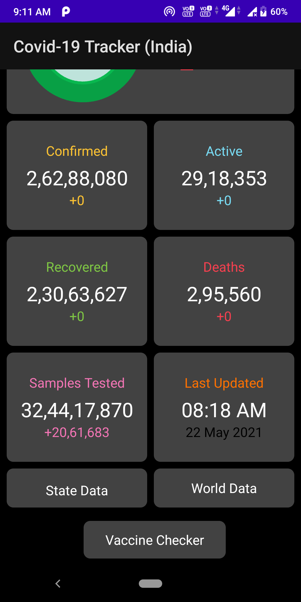
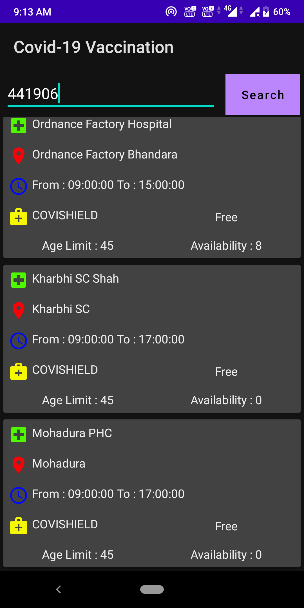
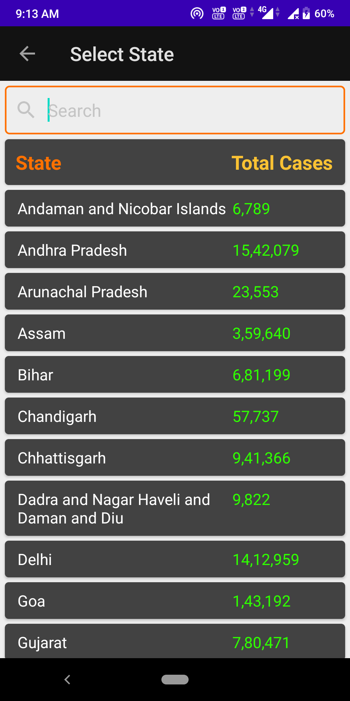
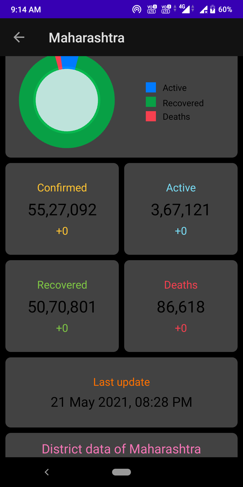
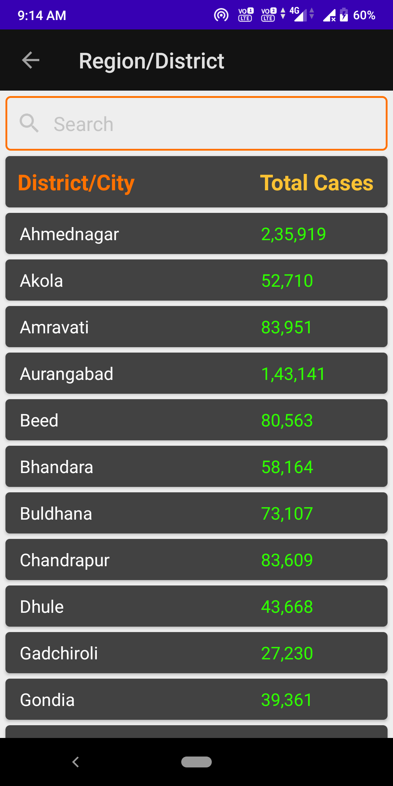
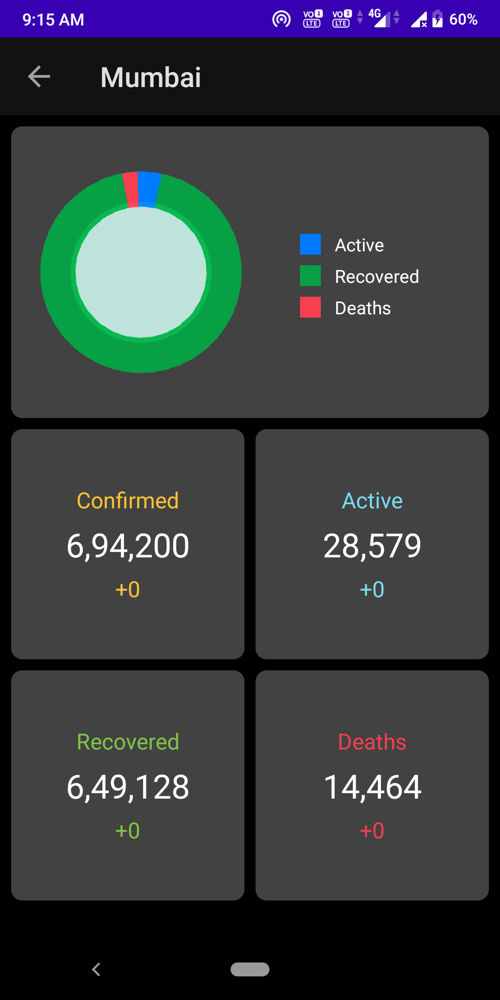
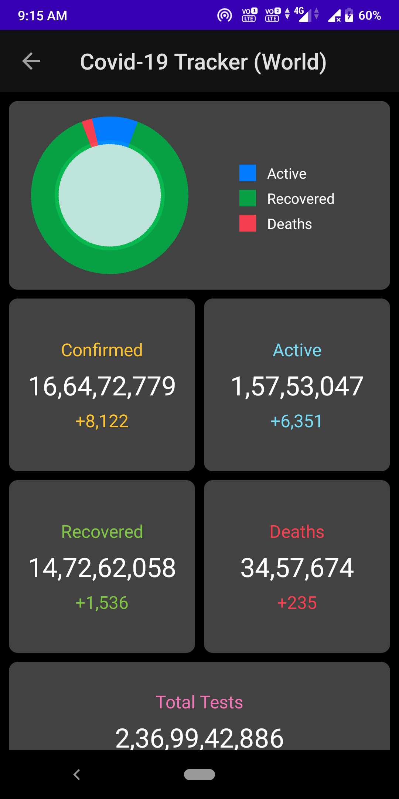
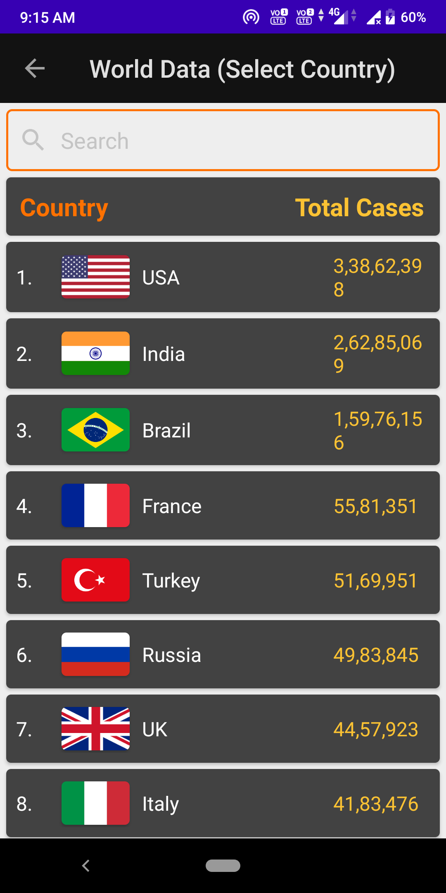
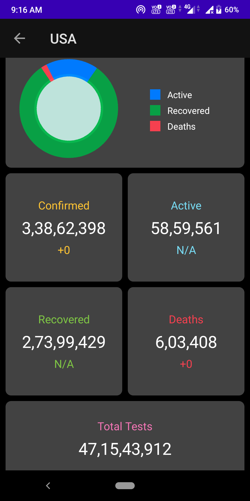

# Covid-19-Tracker-and-Vaccination-checker

This Android Application help you for Vaccination is available in your area or not.Just Enter Your Pincode Number and you Will Get Results. 
    

In Home Screen We have three things first State data then World data then Vaccine Checker.

   

We first Check covid patient Every State of India This Each and everydetails fetch from covid Server using Volley dependency. 

    

After State we can check Every District details.

   

We Can Check the WorldWide data also.

  

